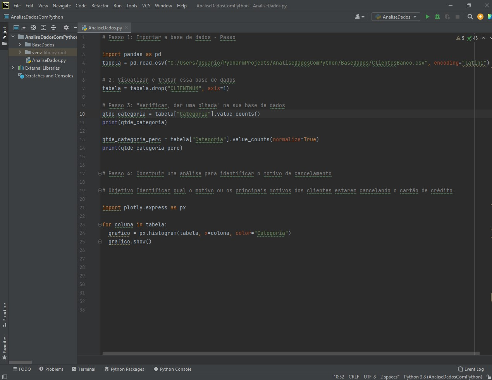
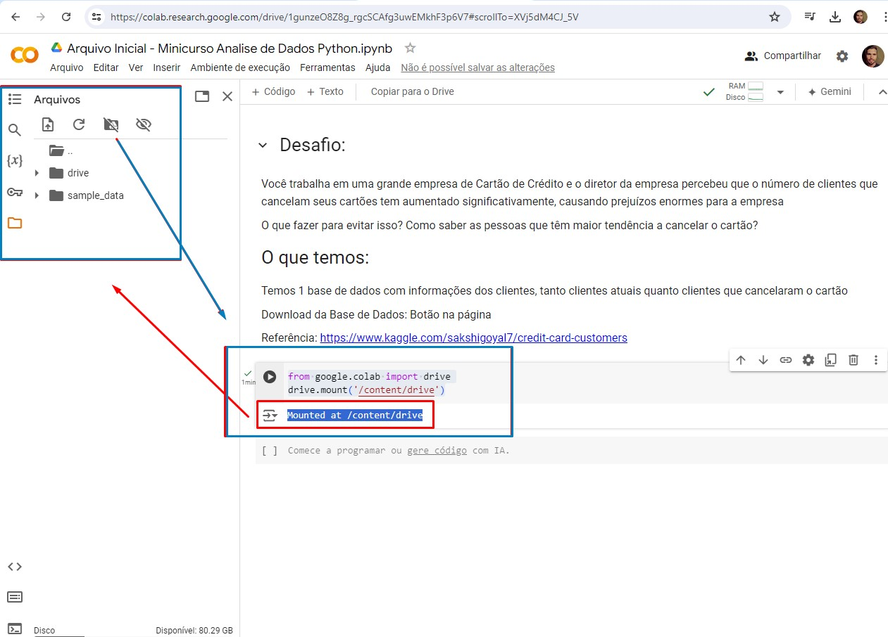
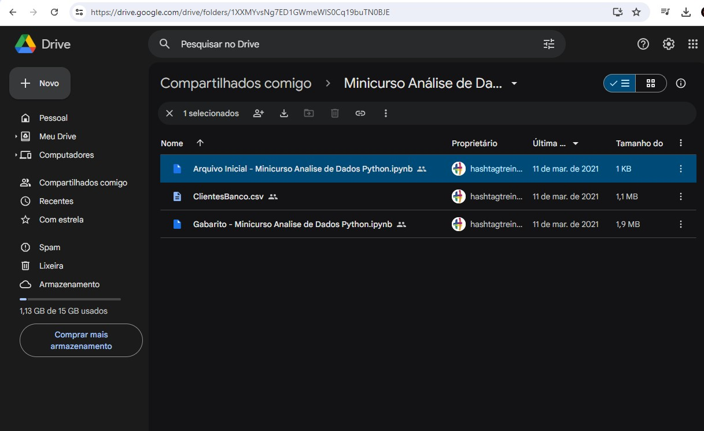
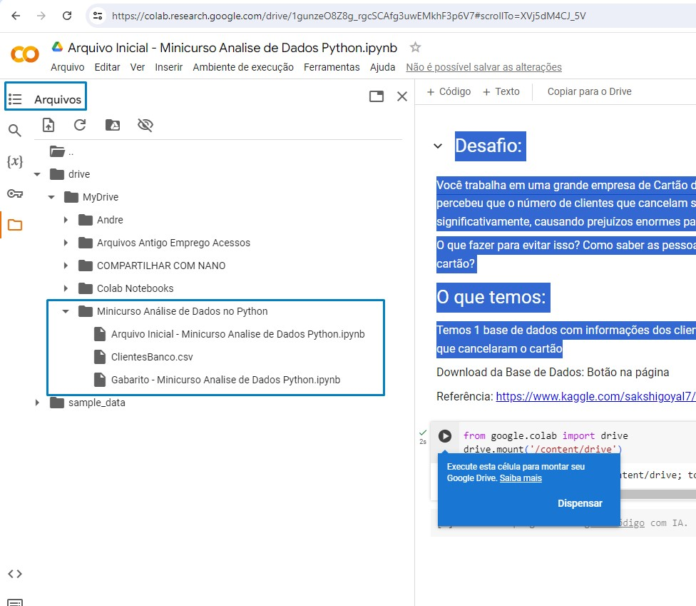
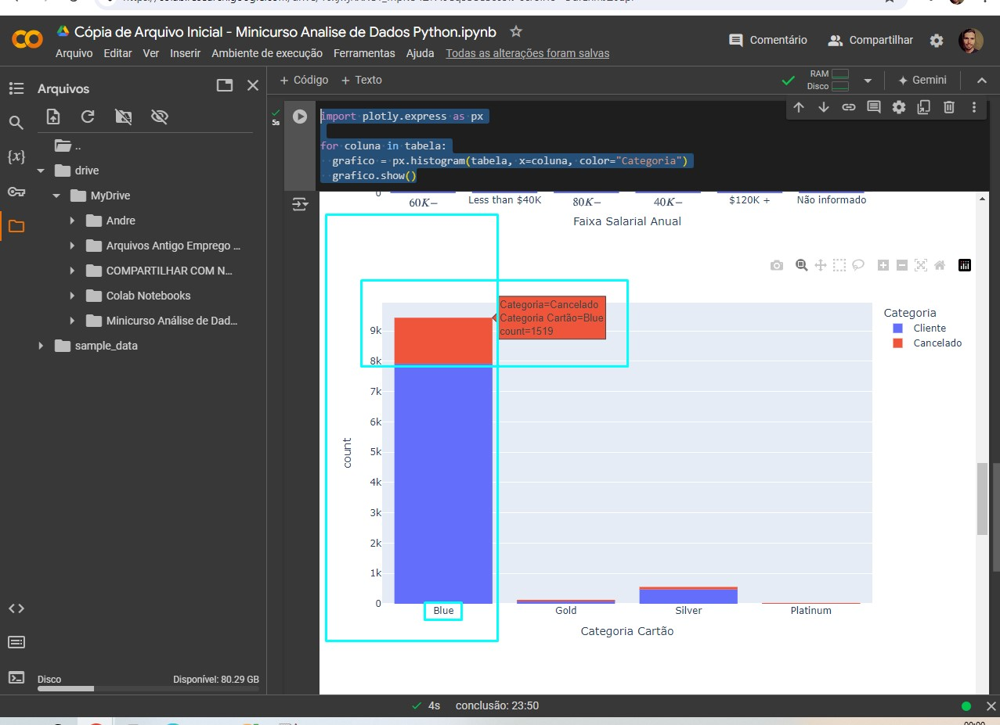

# DataAnalysisPython
 Este projeto aborda Analise de Dados utilizando Python através do Google Colab e PyCham.

# Sobre o projeto

Este projeto aborda o processo de Analise de Dados utilizando Python, este trabalho foi construído a partir do modelo da aula **Minicurso Análise de Dados com Python**, este trabalho contido no youtube, e organizado pelo canal [HastagProgramação].

Este trabalho consiste em um pequeno projeto em programação Python, a plataforma utilizada pode ser desenvolvida tanto pelo Google Colab ou PyCharm, neste caso disponibilizo a imagem e arquivo destes dois meios.
A base de dados consumida é a partir de um arquivo "CSV", utilizamos as bibliotecas "Pandas" para leitura do arquivo e análise e também no final "Plotly" sendo uma biblioteca responsável por gerar gráficos dentro de nossa análise. O tema consiste uma grande empresa de Cartão de Crédito, e o diretor desta empresa percebeu que o número de clientes que cancelam seus cartões tem aumentado signitivamente, causando prejuízos enormes para a empresa. Então este projeto estabeleceu Analise de Dados em Python realizou a Importação da base de dados CSV, a visualização e tratamento destes dados, e assim construir uma análise para identificar o motivo de cancelamento por meio de gráficos
Sendo estes possibilitou identificar os perfis e os motivos dos clientes estarem cancelando o cartão de crédito. 	

## Projeto feito em PyCharm

## Projeto Feito no Colab

## Base de Dados importada Google Drive arquivo "CSV"

## Grafico a partir da Biblioteca "Plotly" em Python 

# Tecnologias utilizadas
- Python
- Pandas (Biblioteca Python)
- Plotly (Biblioteca Python)

# Interpretador / depurador utilizado (Python)
- PyCharm
- Google Colab

# Autor

Carlos de Camargo Penteado Neto

[https://www.linkedin.com/in/carlos-de-camargo-penteado-neto-83974430]

